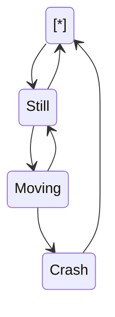

Lorem ipsum dolor sit amet, consectetur adipiscing elit, sed do eiusmod tempor incididunt ut labore et dolore magna aliqua. Imperdiet massa tincidunt nunc pulvinar sapien et ligula ullamcorper. Magna sit amet purus gravida quis blandit turpis cursus in. Viverra vitae congue eu consequat ac felis donec et odio. Morbi enim nunc faucibus a pellentesque sit amet porttitor eget. Tristique senectus et netus et. Adipiscing tristique risus nec feugiat in fermentum posuere urna nec. Id eu nisl nunc mi. Senectus et netus et malesuada fames ac turpis. Et ligula ullamcorper malesuada proin libero nunc consequat. Tellus at urna condimentum mattis pellentesque id. Tortor pretium viverra suspendisse potenti nullam ac.

In vitae turpis massa sed elementum tempus. Nulla aliquet enim tortor at auctor. Phasellus egestas tellus rutrum tellus pellentesque eu tincidunt. Quisque id diam vel quam elementum pulvinar etiam non quam. Blandit libero volutpat sed cras ornare arcu. Tristique magna sit amet purus gravida quis blandit turpis. Dui nunc mattis enim ut tellus elementum sagittis vitae et. Egestas sed tempus urna et pharetra. Pulvinar pellentesque habitant morbi tristique senectus et netus et malesuada. Non arcu risus quis varius quam quisque id diam vel. Ultrices tincidunt arcu non sodales. Facilisis volutpat est velit egestas dui id ornare. Duis at tellus at urna condimentum mattis pellentesque. Ornare massa eget egestas purus viverra. Neque vitae tempus quam pellentesque. Massa sapien faucibus et molestie ac feugiat.

Luctus accumsan tortor posuere ac ut consequat semper. Sapien faucibus et molestie ac feugiat sed lectus vestibulum mattis. Vitae ultricies leo integer malesuada nunc vel risus commodo viverra. Turpis cursus in hac habitasse platea dictumst. Iaculis at erat pellentesque adipiscing commodo elit at. Lectus arcu bibendum at varius vel pharetra vel. Nisi quis eleifend quam adipiscing vitae. Lacus viverra vitae congue eu consequat ac felis. Sapien et ligula ullamcorper malesuada. In massa tempor nec feugiat nisl pretium fusce id velit. Massa id neque aliquam vestibulum.

<br/>

Adding a comment
<!-- NOTE-swimm-snippet: the lines below link your snippet to Swimm -->
### 📄 scripts/script.js
```javascript
12     
13     const getGridDetails = (url, rows, cols) => {
14     
15       if (isNaN(rows) || rows > 4 || rows < 1) {
16         throw new Error("rows value must be a number between 1 to 4");
17       }
18     
19       if (isNaN(cols) || cols > 4 || cols < 1) {
20         throw new Error("Cols value must be a number between 1 to 4");
21       }
22     
23       createNewDivs(rows, cols);
24     }
```

<br/>

This code snippet is the head section of an HTML document and includes a title for the page and a link to a stylesheet for styling the page. The `title` tag sets the title of the page that appears in the browser tab. The `link` tag references an external CSS file located in the `styles` folder and applies its styles to the HTML elements in the document.
<!-- NOTE-swimm-snippet: the lines below link your snippet to Swimm -->
### 📄 index.html
```html
3      <head>
4      	<title>Smart Mirror</title>
5      	<link rel="stylesheet" type="text/css" href="styles/style.css">
```

<br/>

<div align="center"></div>

<br/>

[[sym-mention:(e60fe056-825c-455f-ac27-8dc2e3db85a7|Z5vhe3)Idit Yeger]]

<br/>

<!--MERMAID {width:100}-->

<!--MCONTENT {content: "stateDiagram-v2<br/>\n\\[\\*\\] \\-\\-\\> Still<br/>\nStill \\-\\-\\> \\[\\*\\]<br/>\nStill \\-\\-\\> Moving<br/>\nMoving \\-\\-\\> Still<br/>\nMoving \\-\\-\\> Crash<br/>\nCrash \\-\\-\\> \\[\\*\\]<br/>\n<br/>"} --->

<br/>

<div align="center"></div>

<br/>

[<--VIDEO-->](https://www.youtube.com/watch?v=-utH17XunI8)

<br/>

This file was generated by Swimm. [Click here to view it in the app](https://swimm-web-app.web.app/repos/Z2l0aHViJTNBJTNBc21hcnQtbWlycm9yJTNBJTNBSWRpdFllZ2VyU3dpbW0=/docs/2bwoo618).
